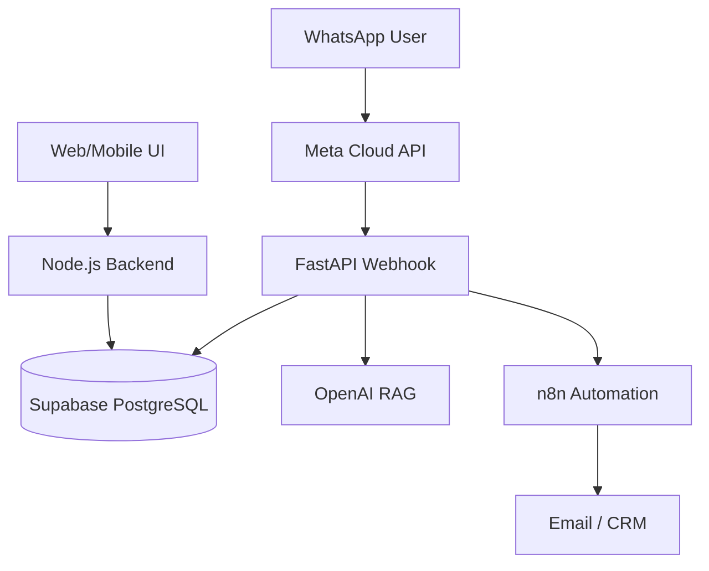
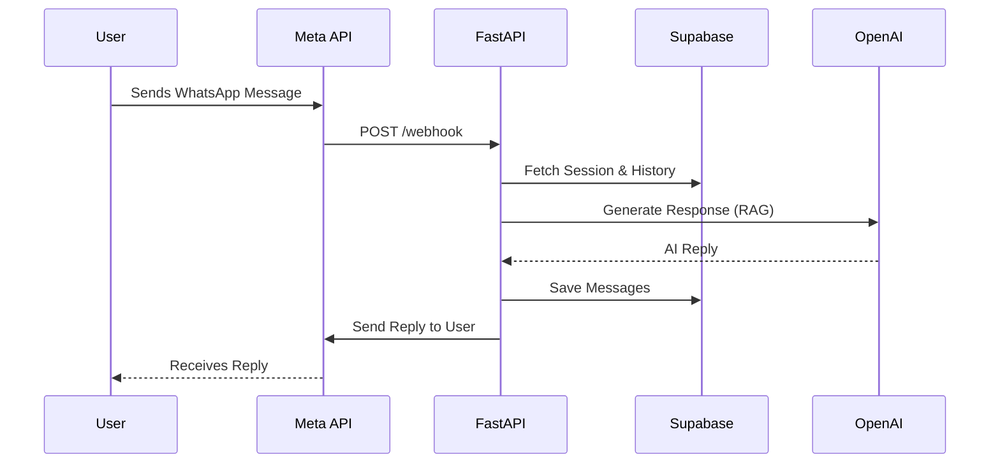

# Architecture Details

## System Architecture

```mermaid
graph TD;
    Client[Web/Mobile UI] --> Express[Node.js Backend]
    Express --> Supabase[(Supabase PostgreSQL)]
    WA[WhatsApp User] --> Meta[Meta Cloud API]
    Meta --> FastAPI[FastAPI Webhook]
    FastAPI --> OpenAI[OpenAI RAG]
    FastAPI --> Supabase
    FastAPI --> n8n[n8n Automation]
    n8n --> Email[Email / CRM]
```

## WhatsApp Sequence Diagram

```mermaid
sequenceDiagram
    participant U as User
    participant M as Meta API
    participant F as FastAPI
    participant S as Supabase
    participant O as OpenAI

    U->>M: Sends WhatsApp Message
    M->>F: POST /webhook
    F->>S: Fetch Session & History
    F->>O: Generate Response (RAG)
    O-->>F: AI Reply
    F->>S: Save Messages
    F->>M: Send Reply to User
    M-->>U: Receives Reply
```
